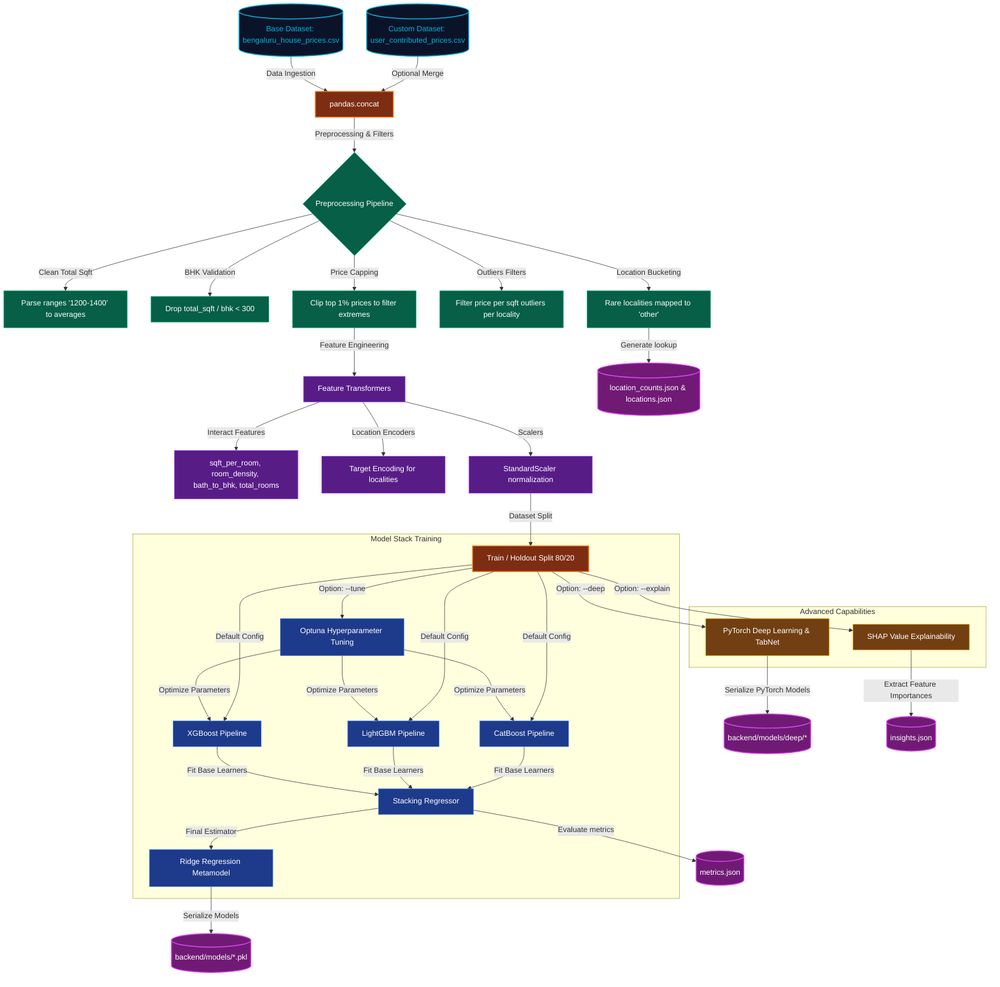

# ML Readme - Property Price Predictor

This folder contains the training engine and feature engineering modules for predicting property prices in Bangalore.

---

## 1. Conceptual System Integration Overview

The flowchart below visualizes how the manual form UI, the CSV dataset uploader, the backend API endpoints, the separate data storage layer, and the asynchronous model hot-reloader connect together:

```mermaid
flowchart TB
    subgraph UI ["Client Application (React UI)"]
        direction LR
        UI_Form["Custom Data Form Panel"]
        UI_Button["Retrain Process Trigger"]
    end

    subgraph API ["Backend API Gateway (FastAPI)"]
        direction TB
        API_Main["FastAPI Router"]
        API_Model["Model Manager (In-Memory)"]
    end

    subgraph Storage ["Persistent Storage Layer"]
        direction LR
        Base_CSV[("bengaluru_house_prices.csv<br/>(Baseline Dataset)")]
        Custom_CSV[("user_contributed_prices.csv<br/>(Custom Listings)")]
    end

    subgraph Training ["Asynchronous ML Pipeline"]
        direction TB
        Train_Engine["Training Sandbox (train.py)"]
        subgraph Artifacts ["Model Registry"]
            Model_PKL[("Ensemble & Tree Models<br/>(models/*.pkl)")]
            Model_PT[("Deep Learning Models<br/>(models/deep/*)")]
        end
    end

    %% Interactions
    UI_Form -->|1. POST /custom-data/add| API_Main
    API_Main -->|2. Save Separately| Custom_CSV
    
    UI_Button -->|3. POST /train| API_Main
    API_Main -->|4. Launch Subprocess| Train_Engine
    
    Base_CSV -->|5a. Base Ingestion| Train_Engine
    Custom_CSV -->|5b. Optional Merge| Train_Engine
    
    Train_Engine -->|6a. Save Trees| Model_PKL
    Train_Engine -->|6b. Save Deep Learning| Model_PT
    
    Model_PKL -->|7. Hot Reload| API_Model
    Model_PT -->|7. Hot Reload| API_Model
    
    API_Model -->|8. Consensus Inference| UI_Form

    %% Styling Classes
    classDef default fill:#1e293b,stroke:#475569,stroke-width:1px,color:#f8fafc;
    classDef ui fill:#1e1b4b,stroke:#6366f1,stroke-width:2px,color:#ffffff;
    classDef api fill:#064e3b,stroke:#10b981,stroke-width:2px,color:#ffffff;
    classDef storage fill:#0b1329,stroke:#00b4d8,stroke-width:2px,color:#00b4d8;
    classDef pipeline fill:#7c2d12,stroke:#f97316,stroke-width:2px,color:#ffffff;
    classDef registry fill:#581c87,stroke:#c084fc,stroke-width:2px,color:#ffffff;

    class UI_Form,UI_Button ui;
    class API_Main,API_Model api;
    class Base_CSV,Custom_CSV storage;
    class Train_Engine pipeline;
    class Model_PKL,Model_PT registry;

    %% Subgraph Styling
    style UI fill:#13132d,stroke:#6366f1,stroke-width:1px,stroke-dasharray:5 5;
    style API fill:#0a1f18,stroke:#10b981,stroke-width:1px,stroke-dasharray:5 5;
    style Storage fill:#051c24,stroke:#00b4d8,stroke-width:1px,stroke-dasharray:5 5;
    style Training fill:#210f08,stroke:#f97316,stroke-width:1px,stroke-dasharray:5 5;
    style Artifacts fill:#180a24,stroke:#a855f7,stroke-width:1px,stroke-dasharray:5 5;
```

---

## 2. Machine Learning Pipeline Flowchart

The flowchart below outlines the data ingestion, preprocessing filters, model stacking, hyperparameter optimization, and output artifact exportation of the ML pipeline.

---

## 3. Preprocessing & Feature Engineering Details

The preprocessing steps defined in `ml_project/preprocessing.py` ensure high data quality and representational capacity for regression fitting:

1. **Total Sqft Parsing**: Resolves range strings (e.g. `"1200 - 1400"`) into floating averages (`1300.0`) and drops non-numeric artifacts.
2. **Locality Binning**: Locations with 10 or fewer listings are collapsed into a generic `"other"` category to prevent target-encoder overfitting on thin data.
3. **Outlier Filtering**: Listings exceeding standard deviations of price-per-square-foot in their respective localities are dropped to remove data-entry anomalies.
4. **Interaction Variables**: Captures critical property design ratios:
   * **Room Density**: $\text{BHK} / (\text{Total Sqft} / 1000)$
   * **Bathroom-to-BHK Ratio**: $\text{Bathrooms} / \text{BHK}$
   * **Square Feet per Room**: $\text{Total Sqft} / (\text{BHK} + \text{Bathrooms})$

---

## 4. Stacking Ensemble Architecture

The core model is a **Stacking Regressor** (`sklearn.ensemble.StackingRegressor`) consisting of:
* **Base Regressors**:
  1. **XGBoost Regressor** (`xgboost.XGBRegressor`) inside a processing Pipeline.
  2. **LightGBM Regressor** (`lightgbm.LGBMRegressor`) inside a processing Pipeline.
  3. **CatBoost Regressor** (`catboost.CatBoostRegressor`) (if installed).
* **Final Metamodel**:
  * **Ridge Regressor** (`sklearn.linear_model.Ridge`) trained using Out-Of-Fold (OOF) cross-validation predictions from base learners.

---

## 5. Advanced Deep Learning Models (PyTorch)

When the `--deep` flag is enabled, the pipeline trains two deep learning architectures implemented in PyTorch under `ml_project/deep/`:

1. **Embedding MLP**:
   * **Architecture**: A Multi-Layer Perceptron (MLP) that dynamically handles categorical inputs (like `location`) using learnable low-dimensional embedding layers. These embeddings are concatenated with standardized continuous features and routed through fully connected hidden layers with ReLU activations, batch normalization, and dropout.
   * **Inference Serving**: The weights are serialized to `backend/models/deep/embedding_mlp.pt` along with categorical mappings in `encoders.json`. During API requests, the backend `ModelManager` (defined in [model.py](file:///e:/Rasonix_ML_Project/backend/app/ml/model.py)) loads this model and feeds predictions dynamically into the consensus ensemble (displayed as **Deep Learning MLP**).
2. **TabNet**:
   * **Architecture**: A PyTorch-based Tabular Attention Network that implements sequential attention selection to choose features at each decision step, providing self-explainability and neural routing tailored specifically for tabular datasets.

---

## 6. In-Training Flags and Utilities

Run the pipeline from the project root using `python ML/train.py` with the following flags:

* `--tune`: Launches **Optuna** hyperparameter search running 15 validation trials per learner to optimize cross-validated $R^2$ before stacking.
* `--explain`: Evaluates the **SHAP** TreeExplainer on the LightGBM model, generating the top 8 global features and exporting them to `insights.json` for frontend analytics.
* `--deep`: Trains PyTorch-based **Embedding MLP** and **TabNet** architectures, writing metrics to `metrics.json` for comparative research logs.
* `--custom-data <path>`: Integrates user-provided CSV listings with the main dataset before fitting models.

### Subprocess Console Logging Redirection
The retraining console captures and streams stdout and stderr to the frontend. To prevent harmless logs and libraries from polluting stderr with false-alarm error prefixes:
* **Optuna Trial Logs** (e.g., `[I 2026-06-03 ...]`) are automatically demoted and routed to `[INFO]` severity.
* **PyTorch/TabNet Warnings** (e.g., `UserWarning`) are demoted and routed to `[WARNING]` severity.
* This ensures that only true execution failures are marked as `[ERROR]` inside the retraining terminal UI.

---

## 7. Windows Compatibility & Deep Learning Training Fixes

To ensure robust execution of the Deep Learning (`--deep`) pipeline on Windows systems:
1. **DLL Initialization Fix**: We pre-import `torch` at the very entry point of the training script. This prevents `WinError 1114` DLL initialization failures that occur when OpenMP runtimes (`libiomp5md.dll` or similar) are loaded in an incorrect order by `lightgbm`/`xgboost` and `torch`.
2. **Stacking Regressor Deadlock Prevention**: Changed `n_jobs` in `StackingRegressor` from `-1` to `None` (sequential training). This avoids multiprocessing deadlock issues on Windows when spawning child processes that initialize both PyTorch and gradient boosting frameworks in parallel.
3. **Training Progress Visibility**: Added active progress logging to print the average loss at key epochs (e.g., 1, 10, 20, ..., 80) during the training of the Embedding MLP, preventing the console from appearing frozen/hung.
