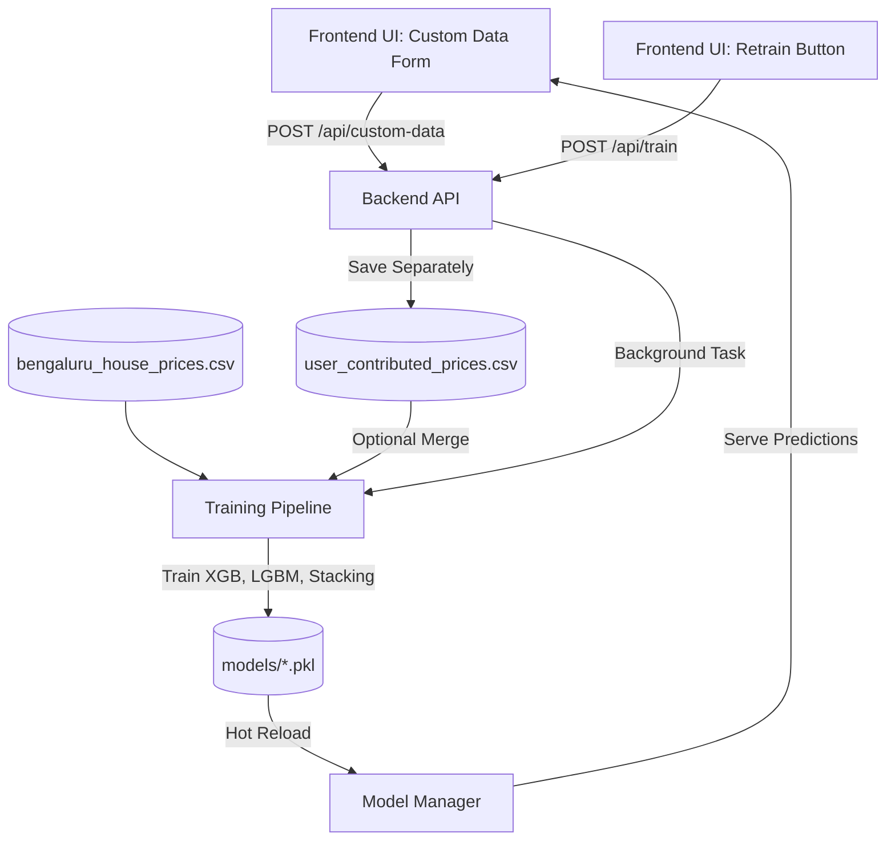
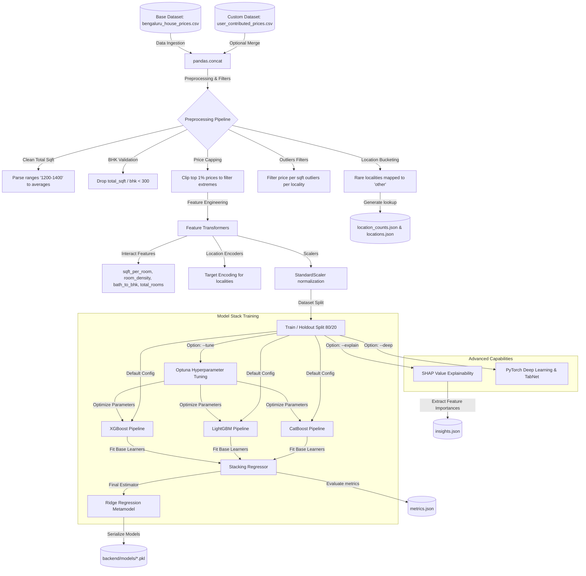

# Property Analytics - Machine Learning Pipeline

This folder contains the training engine and feature engineering modules for predicting property prices in Bangalore.

---

## 1. Conceptual System Integration Overview

The flowchart below visualizes how the manual form UI, the CSV dataset uploader, the backend API endpoints, the separate data storage layer, and the asynchronous model hot-reloader connect together:

---

## 2. Machine Learning Pipeline Flowchart

The flowchart below outlines the data ingestion, preprocessing filters, model stacking, hyperparameter optimization, and output artifact exportation of the ML pipeline.

---

## 3. Preprocessing & Feature Engineering Details

The preprocessing steps defined in `ml_project/preprocessing.py` ensure high data quality and representational capacity for regression fitting:

1. **Total Sqft Parsing**: Resolves range strings (e.g. `"1200 - 1400"`) into floating averages (`1300.0`) and drops non-numeric artifacts.
2. **Locality Binning**: Locations with 10 or fewer listings are collapsed into a generic `"other"` category to prevent target-encoder overfitting on thin data.
3. **Outlier Filtering**: Listings exceeding standard deviations of price-per-square-foot in their respective localities are dropped to remove data-entry anomalies.
4. **Interaction Variables**: Captures critical property design ratios:
   * **Room Density**: $\text{BHK} / (\text{Total Sqft} / 1000)$
   * **Bathroom-to-BHK Ratio**: $\text{Bathrooms} / \text{BHK}$
   * **Square Feet per Room**: $\text{Total Sqft} / (\text{BHK} + \text{Bathrooms})$

---

## 4. Stacking Ensemble Architecture

The core model is a **Stacking Regressor** (`sklearn.ensemble.StackingRegressor`) consisting of:
* **Base Regressors**:
  1. **XGBoost Regressor** (`xgboost.XGBRegressor`) inside a processing Pipeline.
  2. **LightGBM Regressor** (`lightgbm.LGBMRegressor`) inside a processing Pipeline.
  3. **CatBoost Regressor** (`catboost.CatBoostRegressor`) (if installed).
* **Final Metamodel**:
  * **Ridge Regressor** (`sklearn.linear_model.Ridge`) trained using Out-Of-Fold (OOF) cross-validation predictions from base learners.

---

## 5. In-Training Flags and Utilities

Run the pipeline from the project root using `sys.executable ML/train.py` with the following flags:

* `--tune`: Launches **Optuna** hyperparameter search running 15 validation trials per learner to optimize cross-validated $R^2$ before stacking.
* `--explain`: Evaluates the **SHAP** TreeExplainer on the LightGBM model, generating the top 8 global features and exporting them to `insights.json` for frontend analytics.
* `--deep`: Trains PyTorch-based **Embedding MLP** and **TabNet** architectures, writing metrics to `metrics.json` for comparative research logs.
* `--custom-data <path>`: Integrates user-provided CSV listings with the main dataset before fitting models.
