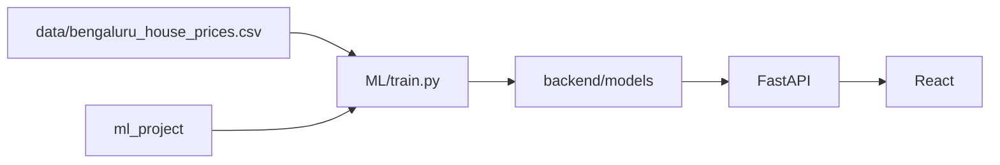

# Bangalore House Price ML Project

A full-stack machine learning application for predicting house prices in Bangalore.

## Project structure

```text
ML_Project/
├── backend/            # FastAPI service
├── frontend/           # React + Vite dashboard
├── ml_project/         # Shared ML package (training + inference)
├── ML/                 # Training entrypoint
├── data/               # Raw datasets
├── notebooks/          # EDA & research (see notebooks/README.md)
├── tests/              # pytest suite
├── scripts/            # Setup helpers
└── docker-compose.yml  # Container orchestration
```

## Quick start

### Automated setup (Windows)

```powershell
.\scripts\setup.ps1
```

### Manual setup

```powershell
python -m venv .venv
.\.venv\Scripts\activate
pip install -r requirements-dev.txt
python ML/train.py
```

### Run the API

```powershell
cd backend
uvicorn main:app --reload
```

API docs: http://localhost:8000/docs

### Run the frontend

```powershell
cd frontend
cp .env.example .env   # or create .env with VITE_API_URL=http://localhost:8000
npm install
npm run dev
```

## Environment variables

| Variable | Default | Description |
|----------|---------|-------------|
| `VITE_API_URL` | `http://localhost:8000` | Frontend API base URL |
| `MODEL_DIR` | `backend/models` | Directory for `.pkl` artifacts |
| `REQUIRE_MODELS` | `true` | Fail API startup if models missing |
| `CORS_ORIGINS` | `http://localhost:5173,...` | Allowed CORS origins |

## Model consensus

The API returns predictions from XGBoost, LightGBM, and a stacking ensemble. The primary price prefers the ensemble model; the response includes per-model values, spread percentage, and consensus method.

## Docker

```powershell
# Train models first (artifacts mounted into backend)
python ML/train.py
docker compose up --build
```

## Testing

```powershell
pip install -r requirements-dev.txt
python ML/train.py
pytest tests/ -v
```

## Architecture


